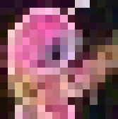
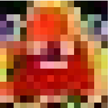
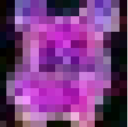
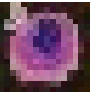
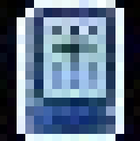
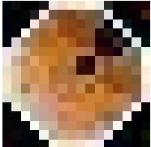
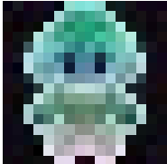
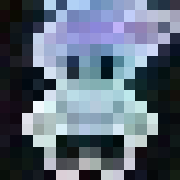
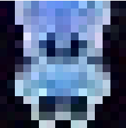

# pixel_art_generator
Training a diffusion model from scratch for 16x16 pixel art generation.

Got the dataset from https://www.kaggle.com/datasets/ebrahimelgazar/pixel-art?resource=download  
The quality of the pixel arts was not that good, but they were good enough to resemble a real entity.

# IMAGES GENERATED  

## Label 1 (Humanoid Enemies)

# Label 2 (Monsters)

# Label 3 (Food)

# Label 4 (Items)

# Label 5 (Humans)

